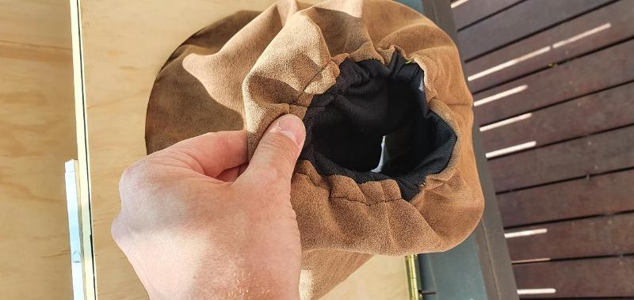
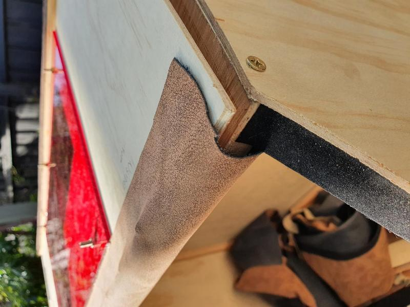

# Wetplate Darkbox Build

Late last year I took a workshop at https://www.goldstreetstudios.com.au/ - I'd long been looking to explore means of photography that do not rely on manufactured films, as a way to future proof my hobby and further remove the digital element... This was one of those things you need to see up close to appreciate. I certainly got hooked and started to map out what would be needed to take this further.

If you are in Australia and interested in any aspect of chemical photography, well worth going to see Ellie Young for one of her workshops. She really is a great teacher!

I've already got a full 4x5 set up; so to make Wet Plate happen for me is the need for a Darkbox which can be used in the field to sensitize the emulsion. As the 'wet' plate process needs to be fully completed before the plate dries, this has to be done close to where the camera is.

My main considerations in building this were:
* large enough to allow future use up to 8x10
* can be used as storage for equipment when not in use
* useable for loading 4x5 film, not just wet plate.
* built with tools on hand (jigsaw, hand tools)

Inspiration came from Roger Hyam who is working in Scotland with glass plates. Roger provided some good advice via email, particularly with the size of windows and reflections from outside. This is probably the most difficult problem to overcome in practical use.

Also shout out to Eric Retterbush and Borut Peterlin for comments!

Anyway - here is the finished product. 40cm deep, 60cm high, 74cm wide. Just under 10kg, so easily enough (for me) to carry - though not too far from the car/shed. Total cost ~$200, including decent quality timber.

## Construction

Top and bottom are 18mm plywood for strength, the rest is 3mm plywood to make the whole thing light. 45 degree angles to keep it simple. No real design, so it turned out a bit bigger than intended!!

There is 12mm bracing to provide stability. This enabled me to make two doors, which I hadn't planned initially. There are two vertical braces in the back also for added strength and to allow for future shelving to be attached to something.

The top panel has a red acrylic panel to provide both a window and light inside. This works pretty well, except when in direct sunlight. I am planning to build a simple collapsible viewer/screen out of cardboard to block direct light. The light works well for indoor use. Sunlight works well enough when outside.

I've used 600mm hinges. the 3mm plywood can't take screws, so these are M4 bolts that I later cut down to size with a Dremel.

## Making it work

The front has a baffle arrangement to act as a light seal. This also gives strength to the front door and makes it seal shut. There aren't any catches/locks/etc.. I used adhesive felt from another project. Later there will be additional strips of wood all the way around the door. These are jsut glued into place.

The collodion emulsion is only sensitive to UV through to Blue, so having a lot of red light is not a problem. The window is cut from an A3 sheet. It's bolted on using M4 bolts. You can see how clear the view is. It will hopefully be practical enough in use.

Probably the biggest single expense was a $22 sensor light meant for cupboards. This is fitted with left over acrylic and fitted just inside the door. When I move my arms inside, the light comes on. Pretty neat! But in all likelihood not nearly bright enough for a summers day!

Here I'm gluing some 'pleather' fabric (left over from next step) to cover the length of the door and make a light tight seal. The pleather is polyester based on the front with fabric backing. The glue isn't quite up to it, but seems strong enough for joints that won't get much tension. The wood is just to help add pressure as the glue sets.

## Sewing

Shout out to my fabulous wife and her sewing machine. The pleather is easy to sew through, but not so easy to feed. There is some guesswork in cutting the pattern here, but it's not critical, as elastic will pull it all together and into it's own shape. I'm using some old track suit pants I'm no longer allowed to wear in public as my second layer. This helps keep light tightness when moving my hands in and out of the box. TBD how effective it really is.

At first I tried glue...

...but glue isn't strong enough for my liking. I'm using some 3mm plywood to really lock it down. It really needs both.

The elstic works reasonably well. Good enough I think..

## Refinements

Added a magnetic catch on the top because it was easy. I tried to fit some arrangement for the bottom door, but haven't figured out a workable solution. The magents need to hit front on, not slide into position.

Light seals. I also added some more of the adhesive felt in some places to cover the gap right on the side. There is also a flap with another strip of pleather to make the front light proof.

On the left side, I put a simple holder for the silver bath tank. This is for travelling to keep it secured. It just lifts up and out. I'm going to mount a paper roll holder somewhere above this.

## Finished The Framework

The interior is large enough to work with whole-plate or even 8x10 with a bit of luck. You can see here two 8x10 trays and the silver tank.

Height seems to be the main feature people talk about; particularly for larger plate sizes. Seen here is a 500ml bottle and a 250ml cyclinder for reference.

I thought about a fancy shelf to store chemical bottles whilst in transit. I've gone in favour of simplicity and added a shelf to use when working. Bottles and things will be kept in small boxes/holders during transit.

## Final Touches

In email discussions with Eric, he pointed out that AgNO3 will attack wood, so having paint is a good idea. I slathered it on liberally to the bottom and the sides where it is likely to get splashes.

Then comes another quick and dirty solution to carrying plates ready for coating. SInce I have a lot of height, I decided to build a foamcore holder. This uses an elastic strap up front to hold plates in. Seems to work well enough in testing. Can hold at least 12 glass plates - more if I don't mind them touching, e.g. tintypes that aren't as fragile. IF this doesn't work out, it'll get pulled out. 

Pretty happy with it turned out, given I lacked proper woodworking facilities. Someone with a proper table saw could do this much easier. It also cost more than it needed as I went for better quality wood.

## Important Points

I didn't work off a design, which meant I made it bigger than needed, but it's still manageable and can readily scale up for larger plate sizes. Weight by itself is not so bad, but when full of liquids and chems because a little heavy to carry one-handed.

### Inventory
Initially I wanted a delux storage system for everything, now I just have a simple shelf. Because I intend to use the darkbox for storage when not in use, I have three categories for all items: 
* things I need during the shoot layed out inside, like trays and collodion, silver tank on it's stand.
* things I need on the day but not on the shoot, like varnish and silver maintenance that I might do the day before or after. I may want this if I go on a trip or a full day of shooting.
* storage when home for items like raw chemicals, scales, etc., which I use only rarely but can be kept together in storage. This would be taken out when going out shooting.

This helps catalogue and I also think about what I need for each step of the process (as a matrix). If the process is required 'on the day', I need to accomodate for it in storage and use.

### Thanks to others for pointing this out
* Requires painting (probably something not reflecting Blue, i.e. Yellow) as the silver will eat away at the wood.
* Light is needed from the correct angle to see how the developer or collodion flows on the plate.
* The basement is expected to get wet. How to deal with liquids in general.

## Updates To Come

This is all still theoretical until I get some usage out of it - will report back any improvement ideas.

